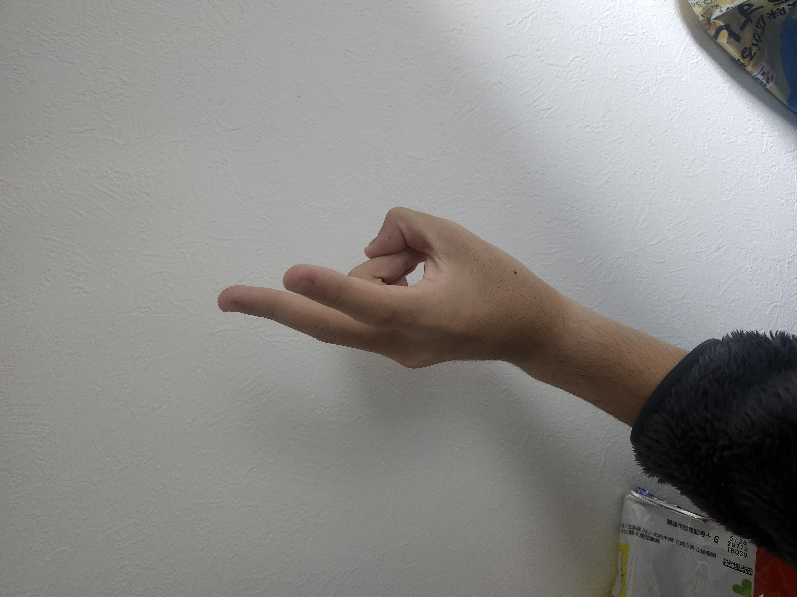
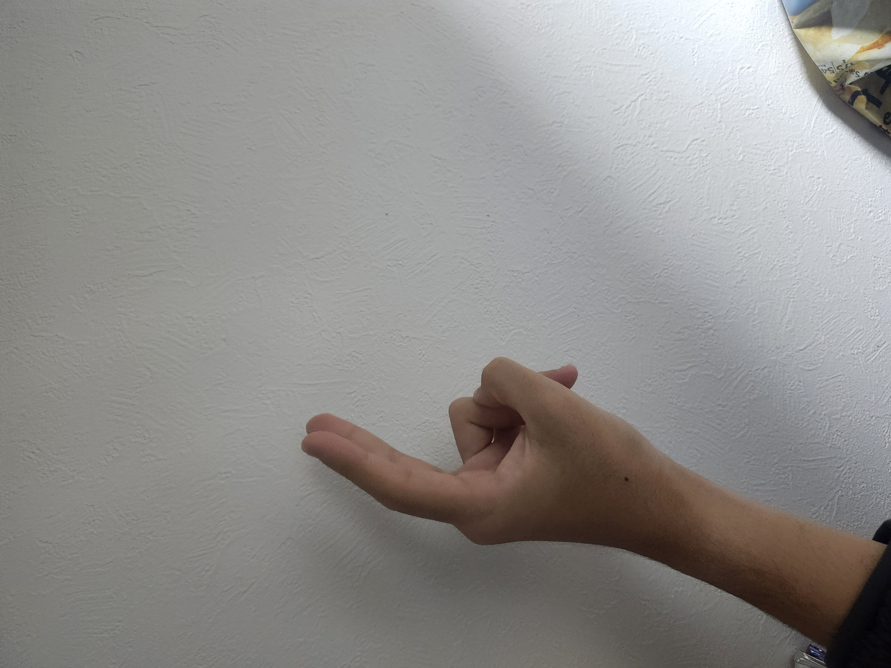
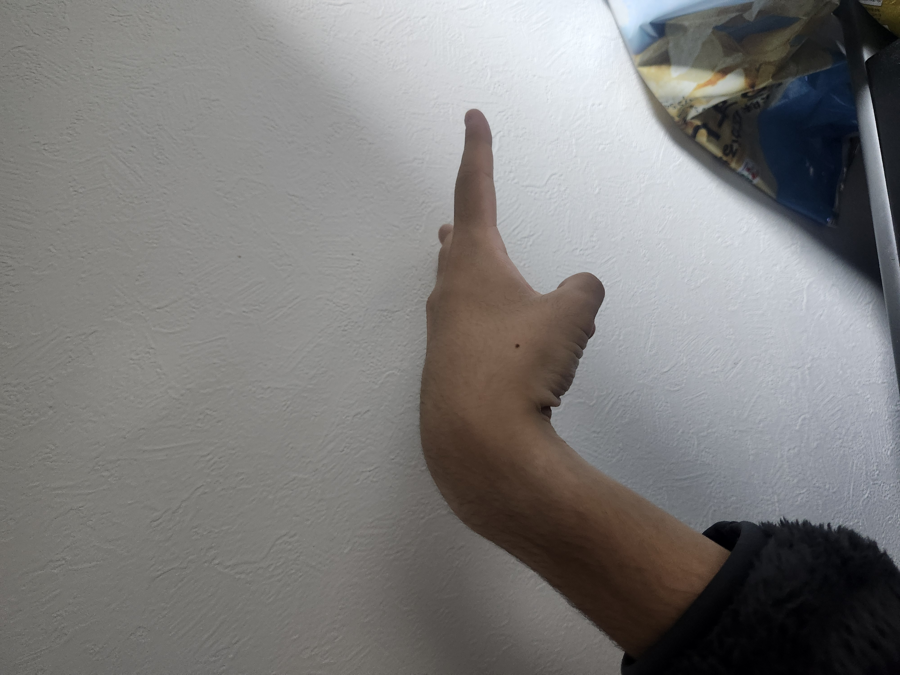

# 🔍 単体テスト画像 推測結果レポート

**生成日時**: 2025年10月30日 01:11:19

---

## 📊 推測サマリー

- **総画像数**: 6枚
- **処理成功**: 6枚
- **処理失敗**: 0枚

### クラス別判定結果

| クラス | 件数 | 割合 |
|--------|------|------|
| ぐー | 2 | 33.3% |
| ちょき | 3 | 50.0% |
| ぱー | 1 | 16.7% |

### 信頼度分布

| 信頼度 | 件数 | 割合 |
|--------|------|------|
| 高 (≥90%) | 6 | 100.0% |
| 中 (70-90%) | 0 | 0.0% |
| 低 (<70%) | 0 | 0.0% |

---

## 📋 全画像の判定結果

| # | 画像プレビュー | ファイル名 | 判定結果 | 信頼度 | ぐー | ちょき | ぱー |
|---|---------------|-----------|---------|--------|------|--------|------|
| 1 |  | `20251030_010949.jpg` | **ぐー** | 99.98% | 100.0% | 0.0% | 0.0% |
| 2 |  | `20251030_010952.jpg` | **ちょき** | 99.85% | 0.2% | 99.8% | 0.0% |
| 3 |  | `20251030_010953.jpg` | **ぐー** | 99.05% | 99.1% | 0.9% | 0.0% |
| 4 |  | `20251030_011001.jpg` | **ちょき** | 99.98% | 0.0% | 100.0% | 0.0% |
| 5 |  | `pa-1.png` | **ぱー** | 100.00% | 0.0% | 0.0% | 100.0% |
| 6 |  | `tyoki-1.png` | **ちょき** | 98.88% | 0.4% | 98.9% | 0.7% |

---

## ✅ 高信頼度判定 (≥90%)

6件の高信頼度判定がありました。

| # | 画像プレビュー | ファイル名 | 判定結果 | 信頼度 |
|---|---------------|-----------|---------|--------|
| 1 |  | `pa-1.png` | **ぱー** | 100.00% |
| 2 |  | `20251030_011001.jpg` | **ちょき** | 99.98% |
| 3 |  | `20251030_010949.jpg` | **ぐー** | 99.98% |
| 4 |  | `20251030_010952.jpg` | **ちょき** | 99.85% |
| 5 |  | `20251030_010953.jpg` | **ぐー** | 99.05% |
| 6 |  | `tyoki-1.png` | **ちょき** | 98.88% |

---

## 📂 クラス別詳細

### ぐー (2件)

**平均信頼度**: 99.52%

| # | 画像プレビュー | ファイル名 | 信頼度 |
|---|---------------|-----------|--------|
| 1 |  | `20251030_010949.jpg` | 99.98% |
| 2 |  | `20251030_010953.jpg` | 99.05% |

### ちょき (3件)

**平均信頼度**: 99.57%

| # | 画像プレビュー | ファイル名 | 信頼度 |
|---|---------------|-----------|--------|
| 1 |  | `20251030_011001.jpg` | 99.98% |
| 2 |  | `20251030_010952.jpg` | 99.85% |
| 3 |  | `tyoki-1.png` | 98.88% |

### ぱー (1件)

**平均信頼度**: 100.00%

| # | 画像プレビュー | ファイル名 | 信頼度 |
|---|---------------|-----------|--------|
| 1 |  | `pa-1.png` | 100.00% |

---

## 📁 ファイル情報

- **モデル**: `model_with_subdirs.keras`
- **画像ディレクトリ**: `tantai-test-img`
- **総処理時間**: 自動計測未実装

---

*このレポートは `check.py` により自動生成されました*
